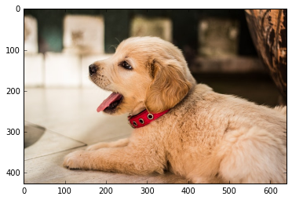
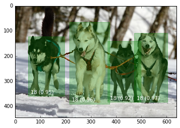

# Tensorflow to TensorRT

Tensorflow model can be converted to TensorRT using [TF-TRT](https://github.com/tensorflow/tensorrt).

> TensorFlow™ integration with TensorRT™ (TF-TRT) optimizes and executes compatible subgraphs, allowing TensorFlow to execute the remaining graph. While you can still use TensorFlow's wide and flexible feature set, TensorRT will parse the model and apply optimizations to the portions of the graph wherever possible. - https://docs.nvidia.com/deeplearning/frameworks/tf-trt-user-guide/index.html

## Installation

If you are using JetPack as your OS TensorRT is preinstalled. Also NVIDIA containers of TensorFlow are built with enabling TensorRT, which means TF-TRT is part of the TensorFlow binary in the container and can be used out of the box.

## Using TF-TRT

### Tensorflow 1.x

SavedModel format:

```python
from tensorflow.python.compiler.tensorrt import trt_convert as trt
converter = trt.TrtGraphConverter(input_saved_model_dir=input_saved_model_dir)
converter.convert()
converter.save(output_saved_model_dir)
```

Frozen graph:

```python
from tensorflow.python.compiler.tensorrt import trt_convert as trt
converter = trt.TrtGraphConverter(
	input_graph_def=frozen_graph,
	nodes_blacklist=['logits', 'classes'])
frozen_graph = converter.convert()
```

### Tensorflow 2.x

SavedModel format:

```python
from tensorflow.python.compiler.tensorrt import trt_convert as trt
converter = trt.TrtGraphConverterV2(input_saved_model_dir=input_saved_model_dir)
converter.convert()
converter.save(output_saved_model_dir)
``` 

> Note: Converting frozen graphs is no longer supported in TensorFlow 2.0.

For more information check out [NVIDIAs TF-TRT User Guide](https://docs.nvidia.com/deeplearning/frameworks/tf-trt-user-guide/index.html).

## Image Classification / Object Detection Example

NVIDIA also provides [a repository](https://github.com/NVIDIA-AI-IOT/tf_trt_models) containing scripts and documentation to use TensorFlow image classification and object detection models on NVIDIA Jetson. Full credit goes to the authors of the repository.

### Installation (taken from [the repository](https://github.com/NVIDIA-AI-IOT/tf_trt_models))

The installation has 5 steps. You should already have everything contained in steps 1-3 installed and can therefore skip these steps.

1. Flash your Jetson TX2 with JetPack 3.2 (including TensorRT).
2. Install miscellaneous dependencies on Jetson

   ```
   sudo apt-get install python-pip python-matplotlib python-pil
   ```
   
3. Install TensorFlow 1.7+ (with TensorRT support).  Download the [pre-built pip wheel](https://devtalk.nvidia.com/default/topic/1031300/jetson-tx2/tensorflow-1-8-wheel-with-jetpack-3-2-/) and install using pip.

    ```
    pip install tensorflow-1.8.0-cp27-cp27mu-linux_aarch64.whl --user
    ```
    
    or if you're using Python 3.
    
    ```
    pip3 install tensorflow-1.8.0-cp35-cp35m-linux_aarch64.whl --user
    ```

    
4. Clone this repository

    ```
    git clone --recursive https://github.com/NVIDIA-Jetson/tf_trt_models.git
    cd tf_trt_models
    ```

5. Run the installation script

    ```
    ./install.sh
    ```
    
    or if you want to specify python intepreter
    
    ```
    ./install.sh python3
    ```

### Image Classification



#### Download pre-trained model

The repository provides you with a function that can be used to download a pretrained model from the TensorFlow model repository.

```python
from tf_trt_models.classification import download_classification_checkpoint

checkpoint_path = download_classification_checkpoint('inception_v2')
```

You can also manually download a model from the [slim folder](https://github.com/tensorflow/models/tree/master/research/slim#Pretrained).

#### Build frozen graph

```python
from tf_trt_models.classification import build_classification_graph

frozen_graph, input_names, output_names = build_classification_graph(
    model='inception_v2',
    checkpoint=checkpoint_path,
    num_classes=1001
)
```

#### Optimize the graph with TensorRT

```python
import tensorflow.contrib.tensorrt as trt

trt_graph = trt.create_inference_graph(
    input_graph_def=frozen_graph,
    outputs=output_names,
    max_batch_size=1,
    max_workspace_size_bytes=1 << 25,
    precision_mode='FP16',
    minimum_segment_size=50
)
```

#### Complete notebook

You can find a comprehensive example under [examples/classification/classification.ipynb](https://github.com/NVIDIA-AI-IOT/tf_trt_models/blob/master/examples/classification/classification.ipynb).

### Object Detection



#### Download pre-trained model

```python
from tf_trt_models.detection import download_detection_model

config_path, checkpoint_path = download_detection_model('ssd_inception_v2_coco')
```

#### Build frozen graph

```python
from tf_trt_models.detection import build_detection_graph

frozen_graph, input_names, output_names = build_detection_graph(
    config=config_path,
    checkpoint=checkpoint_path
)
```

#### Optimize the graph with TensorRT

```python
import tensorflow.contrib.tensorrt as trt

trt_graph = trt.create_inference_graph(
    input_graph_def=frozen_graph,
    outputs=output_names,
    max_batch_size=1,
    max_workspace_size_bytes=1 << 25,
    precision_mode='FP16',
    minimum_segment_size=50
)
```

#### Complete notebook

You can find a comprehensive example under [examples/detection/detection.ipynb](https://github.com/NVIDIA-AI-IOT/tf_trt_models/blob/master/examples/detection/detection.ipynb).

#### Custom model

The same process works for custom models. Just follow my ["Creating your own object detector with the Tensorflow Object Detection API" guide](https://gilberttanner.com/blog/creating-your-own-objectdetector) until you finished training. Then use the checkpoint to generate the frozen graph and optimize it using TensorRT.