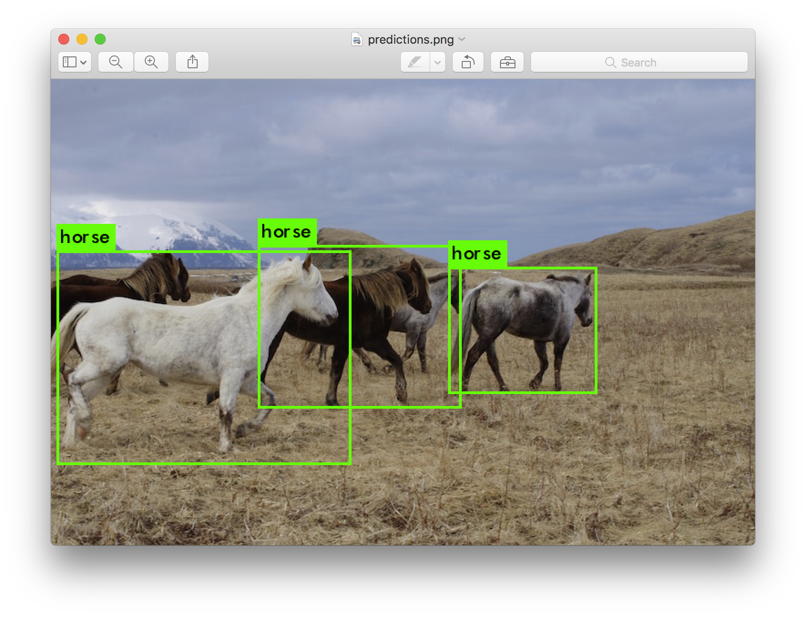
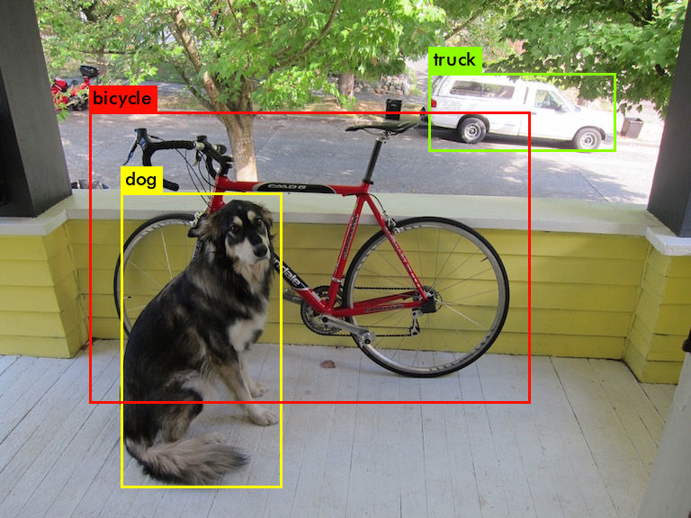
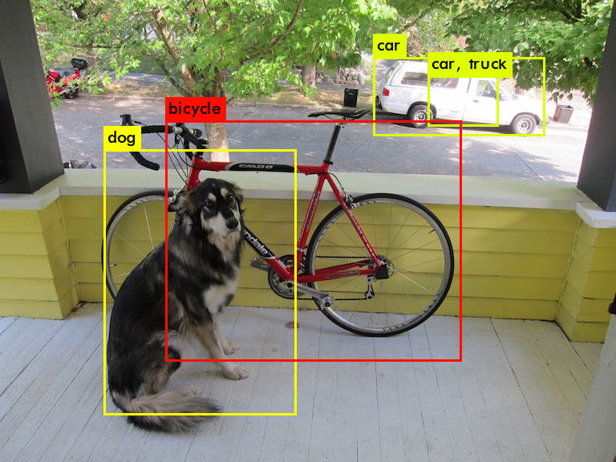
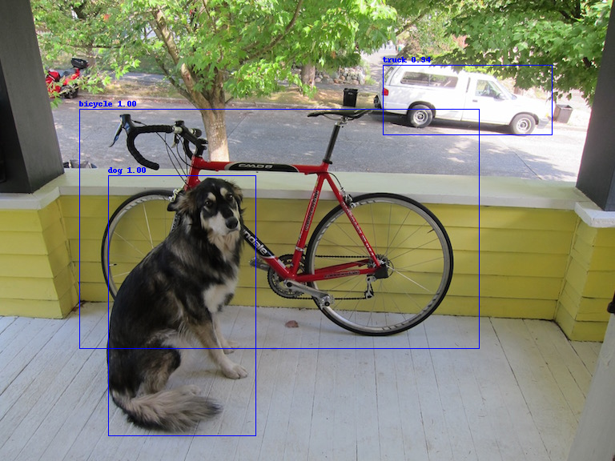

# Yolo Object Detection with Jetson Nano



## Installing Darknet

If you don't already have Darknet installed, you'll have to install it. Darknet can be installed for both CPU or GPU. You can also compile with OpenCV if you want support for more image formats.

We'll make use of [AlexeyAB/darknet](https://github.com/AlexeyAB/darknet), a fork of the original darknet repository with some added features.

To install it on the Jetson Nano, clone the repository, choose if you want to compile with GPU support and OpenCV and change the Makefile accordingly. Then run make.

1. Clone Repository
    ```bash
    git clone https://github.com/AlexeyAB/darknet.git
    cd darknet
    ```

2. Enable GPU and OpenCV support by editing the Makefile
    ```sudo nano Makefile```

    Set the following values:
    * GPU=1
    * CUDNN=1
    * OPENCV=1

3. Compile Darknet
    ```make```

## Detection using a pre-trained model

To run object detection with Darknet, you need a model config and model weights. The config files can be found in the ```cfg``` subdirectory. You'll have to download the pre-trained weights:

```bash
wget https://pjreddie.com/media/files/yolov3.weights
wget https://pjreddie.com/media/files/yolov3-tiny.weights
```

After you've downloaded the weights, you can run the detector on an image.

```bash
./darknet detect cfg/yolov3.cfg yolov3.weights data/dog.jpg
```

You will see an output like this:

```bash
layer     filters    size              input                output
    0 conv     32  3 x 3 / 1   416 x 416 x   3   ->   416 x 416 x  32  0.299 BFLOPs
    1 conv     64  3 x 3 / 2   416 x 416 x  32   ->   208 x 208 x  64  1.595 BFLOPs
    .......
  105 conv    255  1 x 1 / 1    52 x  52 x 256   ->    52 x  52 x 255  0.353 BFLOPs
  106 detection
truth_thresh: Using default '1.000000'
Loading weights from yolov3.weights...Done!
data/dog.jpg: Predicted in 0.029329 seconds.
dog: 99%
truck: 93%
bicycle: 99%
```



Tiny YOLO:

```bash
./darknet detect cfg/yolov3-tiny.cfg yolov3-tiny.weights data/dog.jpg
``` 



## YoloV3 with TensorRT

TensorRT provides an example that allows you to convert a YoloV3 model to TensorRT. If you have TensorRT installed you should be able to find the project under ```/usr/src/tensorrt/samples/python/yolov3_onnx```. You can also find the files inside the [yolov3_onnx folder](yolov3_onnx/). 

### Prerequisites

Install dependencies:
* For Python 2 users, from the root directory, run: ```python -m pip install -r requirements.txt```
* For Python 3 users, from the root directory, run: ```python3 -m pip install -r requirements.txt```

### Running the sample

1. Convert Yolo to ONNX. ```sudo python3 yolov3_to_onnx.py```

    Output:
    ```
    Downloading from https://raw.githubusercontent.com/pjreddie/darknet/f86901f6177dfc6116360a13cc06ab680e0c86b0/cfg/yolov3.cfg, this may take a while...
    100% [................................................................................] 8342 / 8342
    Downloading from https://pjreddie.com/media/files/yolov3.weights, this may take a while...
    100% [................................................................................] 248007048 / 248007048
    [...]
    %106_convolutional = Conv[auto_pad = u'SAME_LOWER', dilations = [1, 1], kernel_shape = [1, 1], strides = [1, 1]]
    (%105_convolutional_lrelu, %106_convolutional_conv_weights, %106_convolutional_conv_bias)
    return %082_convolutional, %094_convolutional,%106_convolutional
    }
    ```
2. Build a TensorRT engine from the generated ONNX file and run inference on a sample image. ```sudo python3 onnx_to_tensorrt.py```

    Output:
    ```
    Downloading from https://github.com/pjreddie/darknet/raw/f86901f6177dfc6116360a13cc06ab680e0c86b0/data/dog.jpg, this may take a while...
    100% [................................................................................] 163759 / 163759
    Building an engine from file yolov3.onnx, this may take a while...
    Running inference on image dog.jpg...
    Saved image with bounding boxes of detected objects to dog_bboxes.jpg.
    Downloading from https://github.com/pjreddie/darknet/raw/f86901f6177dfc6116360a13cc06ab680e0c86b0/data/dog.jpg, this may take a while…
    100% [......................................................................] 163759 / 163759
    Loading ONNX file from path yolov3.onnx...
    Beginning ONNX file parsing
    Completed parsing of ONNX file
    Building an engine from file yolov3.onnx; this may take a while...
    Completed creating Engine
    Running inference on image dog.jpg...
    [[135.04631186 219.14289907 184.31729756 324.86079515]
    [ 98.95619619 135.56527022 499.10088664 299.16208427]
    [477.88941676  81.22835286 210.86738172  86.96319933]] [0.99852329 0.99881124 0.93929232] [16  1  7]
    Saved image with bounding boxes of detected objects to dog_bboxes.png.
    ```

    